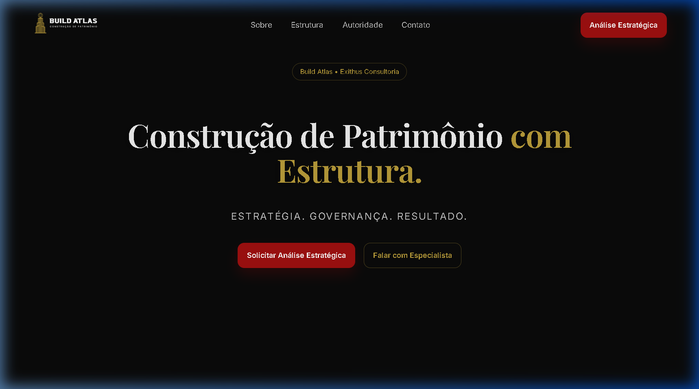
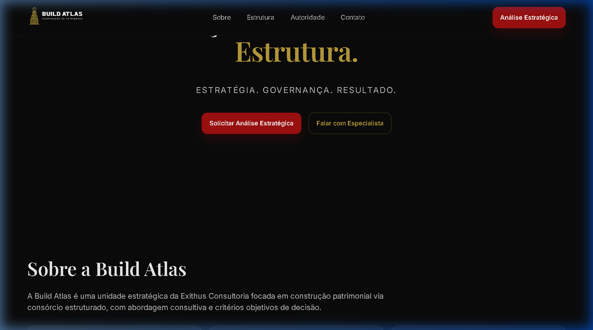
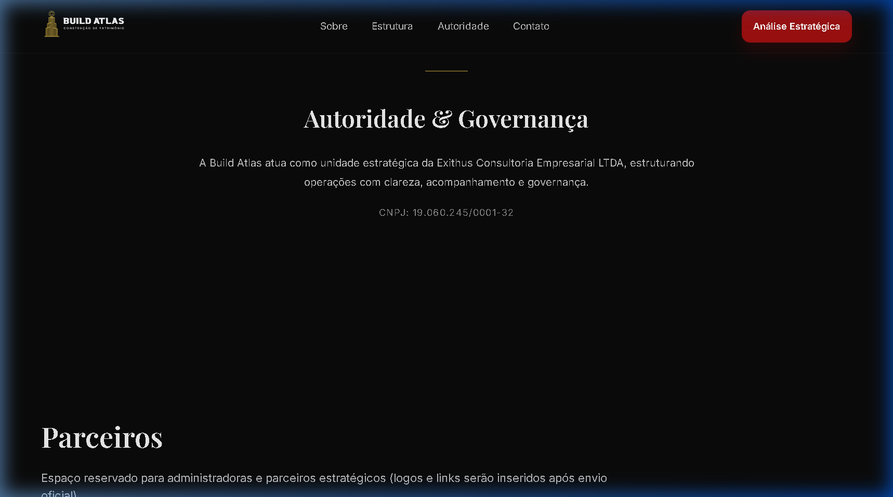
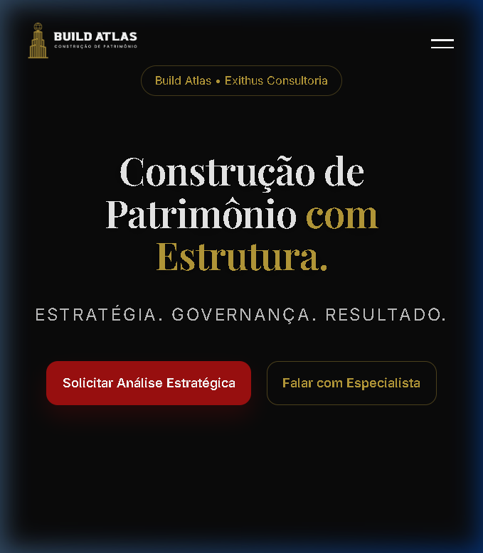
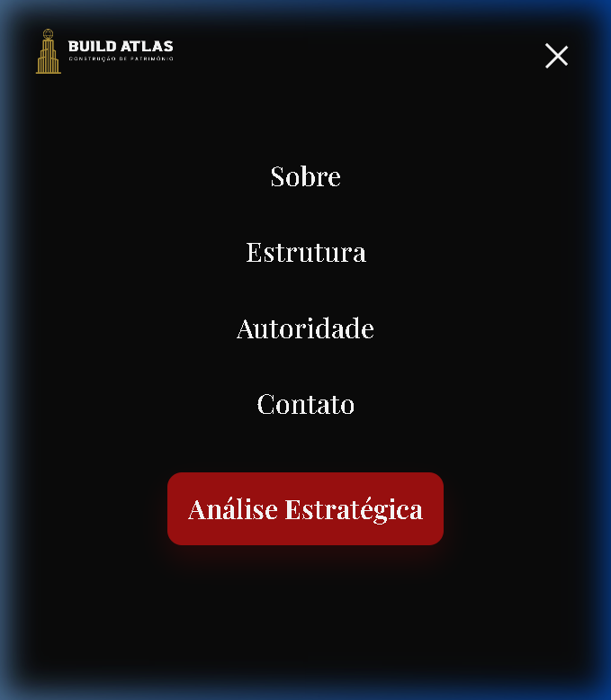

# 📘 BUILD ATLAS — BÍBLIA DA MARCA

> **MASTER BRAND BOOK E DIRETRIZES INSTITUCIONAIS GLOBAIS**
> Versão Definitiva 2026

---

# CAPA

**BUILD ATLAS**
Estrutura. Governança. Patrimônio com Inteligência Estratégica.

Unidade Estratégica da
**Exithus Consultoria Empresarial LTDA**

CNPJ: 19.060.245/0001-32
Uso Estrito e Confidencial

---

# ÍNDICE

1. Introdução & Manifesto
2. Posicionamento Estratégico & Arquétipo
3. Identidade Visual Global (Cores & Tipografia)
4. Sistema de Logotipo
5. Direção Fotográfica Exclusiva
6. UI/UX: A Experiência Digital Premium
7. Aplicação Digital Editorial (Mockups Oficiais)
8. Guia de Comunicação Interna e Externa (O Tom de Voz)
9. Aplicações Práticas (Propostas & Redes Sociais)
10. Conformidade & Governança

---

## 00 — VISÃO EXECUTIVA

A Build Atlas consolida sua posição como unidade estratégica da Exithus Consultoria Empresarial LTDA, focada em estruturação patrimonial via consórcios estruturados com governança e método.

Este documento estabelece:

* Diretrizes visuais
* Diretrizes comportamentais
* Estrutura institucional
* Aplicação digital oficial
* Regras de conformidade

Objetivo:

Garantir coerência absoluta da marca em todos os pontos de contato.

---

# 01 — INTRODUÇÃO & MANIFESTO

A Build Atlas nasce como uma unidade estratégica.
Não como intermediária corretora. Não como uma operação comercial varejista de consórcios.
Entramos no jogo como uma **estrutura de governança patrimonial de alta performance.**

**O Manifesto:**
Construir patrimônio exige mais do que oportunidade. Exige método. Exige clareza. Exige acompanhamento.
A Build Atlas estrutura decisões.
Não vende promessas ilusórias.
Estruturamos estratégias patrimoniais com método e governança.

---

# 02 — POSICIONAMENTO ESTRATÉGICO & ARQUÉTIPO

## Arquétipo Predominante: O Estrategista
Secundário: O Guardião do Patrimônio

**Características Essenciais da Marca:**
* Racional e Analítica
* Confiante (Mostra no que diz)
* Discreta (O silêncio do luxo institucional)
* Elegante e Estruturada

O que a marca NUNCA é:
❌ Agressiva ❌ Apelativa ❌ Promocional ❌ Urgente ("Compre agora!")

## Proposta de Valor
Estratégia aplicada à construção patrimonial por meio de consórcios estruturados.
Transmutar custo (como aluguel) em fomento de equity imobiliário sustentável.

---

# 03 — IDENTIDADE VISUAL GLOBAL

## 🔶 Dourado Oficial (O Fomento)
**HEX:** `#B89B3A`
> Simboliza: Valor, Segurança, Patrimônio e Sofisticação sólida.
> Onde usar: Linhas institucionais e divisórias (Autoridade), destaques em itálico na tipografia e elementos sutis. *Nunca use como fundo dominante.*

## 🔴 Vermelho Premium (A Ação Modulada)
**HEX:** `#9E1010` | **Hover:** `#7E0D0D`
> O uso deve ser estritamente controlado para não cair no amadorismo comercial.
> Onde usar: Botões primários de call-to-action (CTAs) em plataformas digitais e sublinhados técnicos.

## ⚫ Preto Institucional (A Base Estrutural)
**HEX:** `#0A0A0A`
> Transmite solidez, estabilidade, autoridade máxima e maturidade corporativa.
> Base primária de apresentação em materiais de elite (Pitch Decks, Heros Iniciais, Capas de Propostas).

## 🖋️ O Sistema Tipográfico Pleno
* **Para Títulos Estratégicos:** `Playfair Display` (Peso: 600, Tamanhos massivos e com respiro. Letras desenhadas com serifas clássicas traduzem tradição).
* **Para Textos Institucionais e Manuais:** `Inter` (Roboto/Open Sans). Garantem a legibilidade impecável de propostas e parágrafos técnicos online.

---

# 04 — SISTEMA DE LOGOTIPO

* **Versão Principal:** Em orientação Horizontal, aplicada exclusivamente sobre o fundo Escuro (Preto Institucional `#0A0A0A`).
* **Versão Secundária:** Horizontal aplicada a fundos claríssimos de alto contraste (apenas em documentos textuais em A4 impressos).
* **Versão Compacta/Redes:** Foco na Verticalidade arquitetônica do edifício isolado com as letras 'BA'.
* **A Regra de Ouro (Respiro):** Nenhuma informação, forma ou texto concorrente pode invadir um quadrado invisível de altura equivalente a letra 'B' em todo o entorno do logotipo cruzado.

---

# 05 — DIREÇÃO FOTOGRÁFICA EXCLUSIVA

**A Estética da Marca é Cinematográfica e Realista:**
Evite fotos com pessoas olhando para a câmera e rindo excessivamente, transmitindo "banco de imagens grátis".

**Ambientes Sugeridos:**
* Skylines urbanos em horas densas (Golden hour tardia)
* Reuniões estratégicas corporativas (Mãos, pranchetas, fés e arquiteturas)
* Prédios imponentes e simétricos (Estrutura)

**O Filtro Build Atlas:**
Baixa saturação cromática; Overlays pretos entre 70% e 88% opacidade aplicados para abrigar a `Playfair Display` branca.

---

# 06 — UI/UX: A EXPERIÊNCIA DIGITAL PREMIUM

## Hierarquia de Conversão Minimalista
* **Hero (Top of the Funnel):** Pouquíssimas palavras. Impacto estético total. Foco em retenção visual, não em leitura prolongada de atributos.
* **Header de Estado Duplo:** Inicia 100% livre e transparente. Ativa-se no "scroll" assumindo uma cor preta sólida. (Traz senso tecnológico e maduro).
* **Sistema de Botões (Secundários):** Fundo nativo (ghost) com bordas finas Douradas. Para quem não quer clicar de imediato, mas observa opções.
* **A Regra do Ouro da Interface:** Espaçamento amplo (110px a 120px de vazio entre seções). "O Luxo mora no espaço vazio."

---

# 07 — APLICAÇÃO DIGITAL EDITORIAL (MOCKUPS OFICIAIS)

Documentação probatória do design oficial digital através de Renders Editoriais Mockados.

## A. O Hero Institucional Desktop
> "Construção de Patrimônio com Estrutura."

*(Mockup em MacBook Pro. Nota: Destaque dourado e overlay escuro geram senso imediato de Family Office, não de lead-capture barata).*

## B. A Mutação e a Transição

*(O Header revela sua estrutura negra após o scroll analítico. Um exemplo de UI reativa controlada).*

## C. A Governança como Seção de Convergência Limitada

*(A inserção solitária de dados notariais e fiscais, com a linha `#B89B3A`. Uma demonstração nua de legitimidade sem gritos comerciais).*

## D. Ecossistema Responsivo: iPhone
*(Lado Esquerdo: Fechado e Furtivo. Direito: Aberto e Dominante em tela inteira (Overlayer))*
 | 

---

# 08 — GUIA DE COMUNICAÇÃO INTERNA E EXTERNA

## A Postura em Textos, Ligações e WhatsApp
Sempre evoque um posicionamento de *Advisor* ou *Banker*, não de *Corretor com Metas*.

❌ **Erros Fatais (Linguagem Vulgar Comercial):**
* "Não perca a chance de subir no bonde!"
* "Tenho uma cota exclusiva pra você liquidar até hoje à noite."
* "Entra no consórcio que rola até alavancar!"

✅ **Abordagens Oficiais de Consultor:**
* "Verificamos seu balanço patrimonial e uma carta de crédito estruturada faz total sentido para migrar seu custo de funding neste semestre."
* "Olá, [Cliente]. Serei seu Especialista Build Atlas dedicado hoje. Nosso alvo é desenhar a governança de suas aquisições imobiliárias sem onerar liquidez imediata. Qual seu horário nobre amanhã?"

## A Assinatura Institucional Global (E-mails)
```text
[NOME DO DIRETOR / ESPECIALISTA]
Equipe de Estruturação Patrimonial Fixa

—
BUILD ATLAS | Uma Solução Exithus Consultoria
Cel/WhatsApp Institucional: +55 (##) 9####-####
Sede: [Endereço, Ex: Av. Paulista, Conjunto Empresarial C-Level]
Governança Federal: CNPJ: 19.060.245/0001-32
```

---

# 09 — APLICAÇÕES PRÁTICAS

## Instalação da Redes (Social Media Code)
O Instagram NÃO é uma panfletagem de descontos ("Compre aqui consórcio fácil").
O Instagram É uma tese aberta ("Como transformamos o Custo B3 em Ativo Converso de Rentabilidade Direta").
*Cores:* Preto e texto sofisticado. Poucas artes e muita prova intelectual em texto na legenda.

## Pitch & Proposta Comercial em A4/PDF
**Capa:** Fundo 0A0A0A, Título Playfair Dourado, subtítulo com nome da holding familiar do cliente target. Sem logotipo de empresas de consórcio ou bancos intermediários. O cliente compra a *estratégia* Build Atlas.

---

# 10 — CONFORMIDADE & GOVERNANÇA

Este documento, **A Bíblia da Marca Build Atlas 2026** anula integralmente qualquer versão ou esboço anterior não assinado até esta data.

**Compliance Garantido:**
* Uso indevido de logotipo com variação de tons deve ser notificado e retirado do ar.
* A LGPD e a Proteção de Dados seguem o fluxo contido no Frontend Principal de Coleta (`app.js`), validando cookies institucionais obrigatoriamente.
* **Política de Uso de Imagem:** Todas as imagens utilizadas externamente devem seguir o filtro cinematográfico estabelecido (Seção 05). Proibido usar acervos genéricos gratuitos.
* **Padrão de Aprovação de Peças:** Nenhum material digital, tráfego pago ou mídia impressa deverá ser veiculado sem homologação prévia da diretoria estratégica.

**Controle de Atualização de Versão:**
* Versão vigente a partir de: ___ / ___ / 2026
* Validade institucional: Até revisão formal e emissão de substitutivo.

*Todos os Direitos Reservados. Build Atlas (Exithus Consultoria).*
*Desenvolvido e Estruturado por: Archon - SSAG Tecnologia & Inovam Ltda.*
